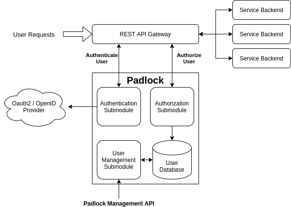

# Padlock - External Authorization Service For REST APIs

`Padlock` is a simple, configurable, and flexible authentication (AuthN) and authorization (AuthZ) service for REST APIs.

The AuthN / AuthZ API supports

* [Nginx Subrequest Authentication](https://docs.nginx.com/nginx/admin-guide/security-controls/configuring-subrequest-authentication/)

* [Traefik ForwardAuth Middleware](https://doc.traefik.io/traefik/middlewares/http/forwardauth/)

* etc.

as an external auth server responding to validation requests from the request proxy.

---

## [Table of Content](#table-of-content)

- [1. Overview](#1-overview)
  * [1.1 User Management](#11-user-management)
  * [1.2 Authentication](#12-authentication)
  * [1.3 Authorization](#13-authorization)
- [2. Configuration](#2-configuration)
  * [2.1 User Roles](#21-user-roles)
  * [2.2 Authorization Rules](#22-authorization-rules)
  * [2.3 Runtime User Discovery](#23-runtime-user-discovery)

---

# [1. Overview](#table-of-content)

<p align="center">
  
</p>

`Padlock` consists of three submodules:

* `User Management`

* `Authentication`

* `Authorization`

## [1.1 User Management](#table-of-content)

The user management submodule is the administrative API of `Padlock`. Through this API, an administrator can

* Perform CRUD operations on users known and managed by `Padlock`.
* Associate users with user roles.

> **NOTES:** A user role defines what system permissions a user of this role have within the system being protected. In the context of REST API RBAC, these permissions mainly govern which API calls a user is allowed to make against the REST APIs. **By associating roles with a user, that user inherits the permissions associated with those user roles.**

The set of user roles `Padlock` operates with is provided via configuration at program start; whereas users are administrator defined, or can be [learned at runtime](#23-runtime-user-discovery). The mapping between users and user roles provides the basis for [user request authorization](#13-authorization)

> **NOTES:** A user without permissions will never pass authorization.

## [1.2 Authentication](#table-of-content)

The authentication submodule performs user authentication for user requests arriving at the request proxy. Specifically, the submodule processes the bearer token found in the authorization header included with the user request, and validates that token.

```http
GET /v1/authenticate HTTP/1.1
...
Authorization: bearer {{ token }}
...
```

`Padlock` is designed to validate Oauth2 / OpenID JWT tokens; so the authentication submodule will validate the signature of the bearer token against the Public key of the Oauth2 / OpenID provider's signing key pair.

> **NOTES:** Token introspection will be implemented in the future.

Upon successful validation, the submodule will respond to the request proxy with the following additional information regarding the user as response headers:

* User ID
* Username
* First name
* Last name
* Email

These additional parameters are parsed from the various claims within the JWT bearer token.

> **NOTE:** Since different Oauth2 / OpenID providers include different claims in their JWT, the user is responsible for providing via [configuration](ref/general_application_config.md#authentication-submodule-configuration) which claims to parse for the additional user metadata.

> **NOTE:** Aside from `User ID`, the other metadata fields are optional depending on the presence of the associated claims within the JWT token. **The JWT token must provide `User ID` as a claim.**

## [1.3 Authorization](#table-of-content)

The authorization submodule performs authorization for user requests arriving at the request proxy (i.e. is a user allowed to make that request?). The submodule fetches the parameters regarding the user request from the headers of the HTTP call from the request proxy to `Padlock` for authorization.

```http
GET /v1/allow HTTP/1.1
...
X-Forwarded-Host: {{ User request "host" }}
X-Forwarded-Uri: {{ User request URI path }}
X-Forwarded-Method: {{ User request HTTP method }}
X-Caller-UserID: {{ Caller user ID }}
X-Caller-Username: {{ Caller username }}
X-Caller-Firstname: {{ Caller first name }}
X-Caller-Lastname: {{ Caller last name }}
X-Caller-Email: {{ Caller email }}
...
```

The authorization submodule operates against

* Pre-defined [authorization rules](#22-authorization-rules)
* Mapping between [users and roles](#11-user-management)

Authorization rules define what system permissions would allow a user to make a specific request, and the mapping between users and user roles define what system permissions a user has.

The submodule uses the following request parameters

* `X-Forwarded-Host`
* `X-Forwarded-Uri`
* `X-Forwarded-Method`

to match the request against a specific authorization rule.

With the authorization rule, this user is authorized based on whether the user's system permissions passes the permission check of that authorization rule.

For an unknown user, if [runtime user discovery](#table-of-content) is enabled, the authorization submodule will define a new user within the database using the request parameters

* `X-Caller-UserID`
* `X-Caller-Username`
* `X-Caller-Firstname`
* `X-Caller-Lastname`
* `X-Caller-Email`

> **NOTES:** The newly created user entry starts with no user roles.

# [2. Configuration](#table-of-content)

`Padlock` requires the following configuration during runtime:

* [General Application Config](ref/general_application_config.md): Controls and defines general behavior of the various `Padlock` submodules.
* [OpenID Provider Connection Parameters](ref/openid_provider_param.md): Provides connection parameters for the Oauth2 / OpenID provider to be used by the `authentication` submodule.
* [User Tracking Database Connection Parameters](ref/user_track_database_param.md): User tracking database connection parameters, **not including the user password**.
* Database User Password

More details regarding the various configuration files (i.e. format and content) can be found under [ref](ref/README.md).

> **IMPORTANT:** `Padlock` currently targets only Postgres compatible databases (e.g. AWS Aurora). When connecting with the user tracking database, the application only uses Postgres drivers.

Several important configuration / runtime related concepts will be highlighted in the following subsections.

## [2.1 User Roles](#table-of-content)

User role configurations are, as one would expect, not part of the default configuration built into `Padlock`. Below is an example user role configuration section

```yaml
userManagement:
  userRoles:
    admin:
      permissions:
        - read
        - write
        - modify
        - delete
    reader:
      permissions:
        - read
    writer:
      permissions:
        - write
    user:
      permissions:
        - read
        - write
        - modify
```

The example defines the user roles `admin`, `reader`, `writer`, and `user`; the system permissions associated with each role is listed under `{{ role }}.permissions`.

`Padlock` only supports role assignments, so system permissions can not be directly assigned to a user. By assigning `reader`, the user would gain the permission `read`; by assigning both `reader` and `writer`, the user would gain the permissions `read` and `write`.

When multiple assigned roles have overlapping system permission sets, the final permissions associated with the user would be a union of all system permission sets of each assigned role; by assigning the `reader` and `user` roles, a user would have the permissions `read`, `write`, and `modify`.

Regarding the tracking of users and roles, `Padlock` treats roles as read-only configuration. At program start, `Padlock` will commit to memory the set of roles provided; roles can not be added at runtime. When a user is assigned a role, the only information recorded by the user tracking database is the association between a user and the name of a role; the system permissions granted by that association is based entirely on the provided configuration file. Thus, when configuration changes the system permissions assigned with a role, the associated users automatically inherit the permission sets.

If the set of user roles configured changes between execution of `Padlock`, a clean up will be performed.

* Compare the set of user roles provided in the configuration with the set of user roles referenced in the database.
* For all newly configured roles, mark them in the database.
* For all roles previously referenced in the database, but is now missing from the configuration, remove their references from the database.

As an example

* User `X` was assigned roles `A` and `B`.
* The new configuration no longer mentions role `B`.
* Now, user `X` will only be assigned role `A`.

> **NOTES:** Ideally the role names should not be changed, but their assigned system permissions should be adapted overtime instead.

## [2.2 Authorization Rules](#table-of-content)

## [2.3 Runtime User Discovery](#table-of-content)
